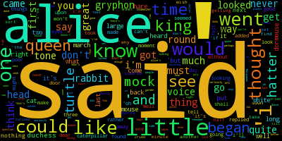
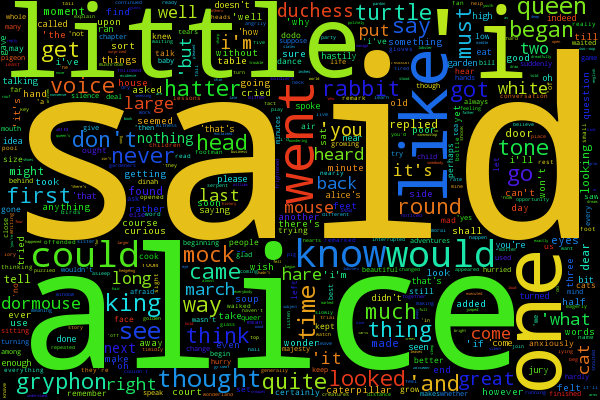
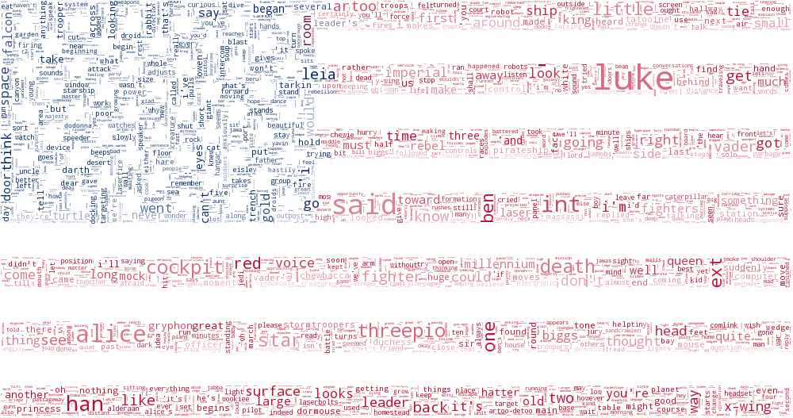

# Examples
This directory contains various examples for using the facebook_wordcloud library.

## Messages
It can take some configuration to get your word cloud looking how you want. I recommend not using your actual `messages.htm` file because this may take a long time to parse, which will get annoying when trying to do quick changes.

I have provided a sample file in this directory that contains a conversation that can be used for testing.

    facebook_wordcloud messages_sample.htm "Foo Bar"

This contains the text of some popular books for word count boosting.

## Word Cloud
The majority of configuration required is for configuring the word cloud. The word cloud library I am using was written by [Andreas Mueller (amueller)](https://github.com/amueller) and can be found at [this link](https://github.com/amueller/word_cloud).

I recommend exploring that library for configuration parameters.

For simplicity, I've provided four examples. The first (`default`) is simply the default parameters (i.e., you don't even need to reference this configuation, but I include it to show the user defaults), the second (`simple`) is a simple modification of those defaults. Getting more advanced, one (`masked`) shows how to mask the word cloud with an image, and the last one (`colored`) shows how to do coloring based on a mask image.

Each example is essentially a `config.json` file that can be specified as a command line argument to the script.

    cd examples
    facebook_wordcloud messages_sample.htm "Foo Bar" -c default/config.json
    facebook_wordcloud messages_sample.htm "Foo Bar" -c simple/config.json
    facebook_wordcloud messages_sample.htm "Foo Bar" -c masked/config.json
    facebook_wordcloud messages_sample.htm "Foo Bar" -c colored/config.json

Masks were found at: http://www.stencilry.org/stencils/

### Default

### Simple

### Masked

### Colored

## Issues
**IOError: Couldn't locate mask file...did you make sure to specify the URL relative to where you are running the script?**
This error is self-explanatory. In `masked/config.json`, the mask file is specified with a relative URL. This URL is *relative to where you are running the script*. I wrote the config file assuming that you were running the `facebook_wordcloud` in the `/examples` directory. If this is not the case, then either `cd` into that directory, or adjust the path in `masked/config.json`.

**The mask doesn't seem to be working?**
I ran into this issue a few times. Make sure the mask is either in RGB or grayscale. Note that only parts that are pure white (#FFFFFF) will be removed.
